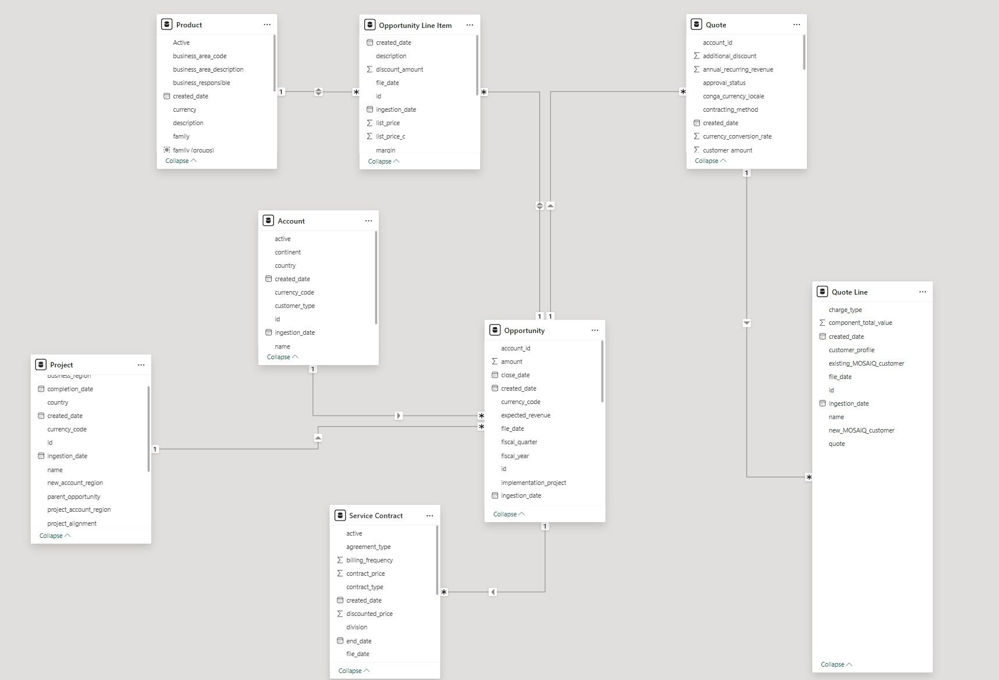

  

    <h1 align="center">Azure Databricks Data Engineer (End-to-end Batch Processing ETL Pipeline) </h1>

		<em>Developed with the tools and platforms below.</em>

	
	
	

##  Table of contents

> - [Overview](#overview)
> - [Tools & Technologies](#key-features)
> - [Data Source](#data-source)
> - [Medallion Architecture](#medaillion-architecture)
> - [Project Structure](#project-structure)
> - [Analytics](#analytics)
> - [Requirement](#requirement)
> - [Getting Started](#getting-started)
> - [Note](#note)

## Overview

This repository demonstrates a comprehensive Data Engineering project utilizing Azure Databricks to build and manage a scalable Data Warehouse solution following the Medallion Architecture. The project is designed to handle large-scale data processing and analytics by leveraging the power of Azure services (Databricks, Data Factory, Data Lake Storage), ensuring efficient data transformation, storage, and retrieval. This project is designed to handle both full-load (will be updated by overwriting) and incremental-load (updated by merge the new data to the old one) data.

## Tools & Technologies

- `Azure Databricks`: Utilized as a Data Lakehouse solution to perform ETL processes and distributed data transformations, combining the flexibility of data lakes with the structure of a data warehouse. Azure Databricks enables scalable and efficient data processing and advanced analytics.
- `Azure Data Lake Storage (ADLS)`: Serves as the primary storage layer, handling raw, intermediate, and final datasets. It integrates seamlessly with Azure Databricks to provide scalable and secure data storage for all layers of the Medallion Architecture.
- `Azure Data Factory`: Orchestrates and controls the entire ETL pipeline, automating the ingestion, transformation, and loading of data across different layers in the Medallion Architecture. It ensures seamless data movement and scheduling, connecting different services within the pipeline.
- `Delta Lake`: Enhances the Data Lakehouse architecture by providing ACID transactions, schema enforcement, and time travel for better data reliability and integrity.

## Data Sources

The data in this project is generated anonymously using Mockaroo, a powerful online tool for creating realistic and anonymous datasets. The dataset mimics CRM data typically found in Salesforce environments, including objects such as Opportunity, Account, Opportunity Line Item, Project, Quote, Quote Line, Product, and Service Contract. 

Each object represents critical elements of a business's sales and project lifecycle. Business use case can be found [here](./appendix/BusinessUseCaseAndDictionary.pdf).

For efficient data processing, the project uses a combination of full load and incremental load strategies. The full load is used for the initial data setup, ensuring all historical data is captured. Incremental loads handle ongoing data ingestion by only processing new or modified records, making the system more efficient over time. 

For incremental data objects, data will be divided by folder, with each folder named as the first date of each month, containing all data from the previous month.

### Full-load Data Object: No partition 

1. `Account`: Stores information about the customers, businesses, or organizations associated with an opportunity, including their name, type, and location.
2. `Project`: Captures detailed information about projects related to accounts and opportunities, such as project status, region, and completion date.
3. `Quote`: Represents formal offers made to customers, containing pricing details, contract terms, and discount structures.

### Incremental-Load Data Object: Partition by date (end of month)

4. `Opportunity`: Represents potential sales or deals that a business is working to close, containing information such as close dates, revenue, and sales stages.
5. `Opportunity Line Item`: Represents the individual products or services included in a sales deal or opportunity.
6. `Quote Line`: Details the individual components of the quote, including product descriptions, prices, and customer-specific discounts.
7. `Product`: Refers to the goods or services that a business sells, including key information such as product codes, categories, and costs.
8. `Service Contract`t: Outlines the terms for services provided to customers, including pricing, contract duration, and renewal details.

### Data Sample

### Data Model 

## Medallion Architecture
The Medallion Architecture is a data design pattern that organizes data into three layers: Bronze (raw, unprocessed data), Silver (cleaned and enriched data), and Gold (highly curated, optimized data) to streamline data processing and analytics. This approach ensures better data quality, traceability, and performance in a scalable way.

## Project Structure
└── Azure-Databricks-Data-Engineer-/

    ├── README.md
    ├── aggregation
    │   ├── 1.customer_profit.py                                          # Calculate customer profitability
    │   ├── 2.product_sold.py                                             # Calculate total product sold by categories
    │   ├── 3.project_created.py                                          # Analyze the number of projects created over time
    │   ├── 4.deal_win_loss_ratio.py                                      # Calculate win/loss ratio of deals
    │   └── 5.cummulative_revenue.py                                      # Calculate cumulative revenue over time
    ├── ingestion
    │   ├── full_load_objects
    │   │   ├── 0.create_bronze_tables                                    # Create bronze tables for all full-load objects
    │   │   ├── 1.create_silver_table_account                             # Create silver table for account
    │   │   ├── 2.create_silver_table_project                             # Create silver table for project
    │   │   └── 3.create_silver_table_quote                               # Create silver table for quote
    │   ├── incremental_objects
    │   │   ├── 1.create_bronze_silver_tables_opportunity                 # Create bronze and silver tables for opportunity data
    │   │   ├── 2.create_bronze_silver_tables_opportunitylineitem         # Create bronze and silver tables for opportunity line item data
    │   │   ├── 3.create_bronze_silver_tables_product                     # Create bronze and silver tables for product data
    │   │   ├── 4.create_bronze_silver_tables_servicecontract             # Create bronze and silver tables for service contract data
    │   │   └── 5.create_bronze_silver_tables_quoteline                   # Create bronze and silver tables for quote line data
    │   └── run_all_ingestion_notebooks.py                                # Script to run all ingestion notebooks sequentially
    └── setup
        ├── 1_create_external_locations.sql                                # Create external locations for Unity Catalog
        ├── 2.create_catalog_and_schema.sql                                # Create new catalog and schema based on the external locations
        └── functions.py                                                   # Common functions used throughout the project

## Analytics

In this project, I will connect **Power BI** to my Azure Databricks cluster to visualize insights derived from the **Silver** and **Gold** layers of the Medallion Architecture. By utilizing Power BI, I can create interactive reports and dashboards, enabling stakeholders to explore key metrics such as customer profitability, product sales, project creation trends, and cumulative revenue growth.

The **Silver Layer** provides cleansed and enriched data ready for analysis, while the **Gold Layer** consists of highly curated datasets optimized for reporting and business intelligence purposes.

For more information on how to connect **Power BI** to Azure Databricks, please refer to the [Microsoft documentation](https://learn.microsoft.com/en-us/azure/databricks/partners/bi/power-bi) for detailed instructions.

Link to the [dashboard](https://app.fabric.microsoft.com/view?r=eyJrIjoiZDlmNjU1ODQtZDhmYS00MzFhLTliMDQtZmExYmIxODAyZDgyIiwidCI6IjgwZTRjYzhlLTA0Y2MtNDM2ZC1hZDIxLThhMDhhMTkwOWJmZSIsImMiOjJ9) built by me and my team.

## Requirement
1. Azure Account - You can register for an Azure account with $200 credit. This projects cost around $50 if finish within 4-5 days
2. Power BI Pro License - You can register for a 60-day free trial. We need this license to embed the report and share with everyone

## Getting started
1. Create Azure Data Lake Storage 
2. Create 3 containers including bronze - silver - gold
3. Use any data simulating generator to generate full-load and incremental-load object data based on sample and dictionary. Then import them into bronze container
4. Create a repo or folder in Databricks
5. Import the dbc file found in this [link](https://learn.microsoft.com/en-us/azure/databricks/partners/bi/power-bi) into that folder so you can help all of the files in the project structure.
6. Modify code details based on Azure Services Credentials and explore the project

## Note
- Please replace the storage account name with your Azure storage account name <'your-data-lake'> and replace catalog name with your catalog name <'your-catalog'>
- Details about Data Factory will be found in folder [azure_data_factory](./azure_data_factory)