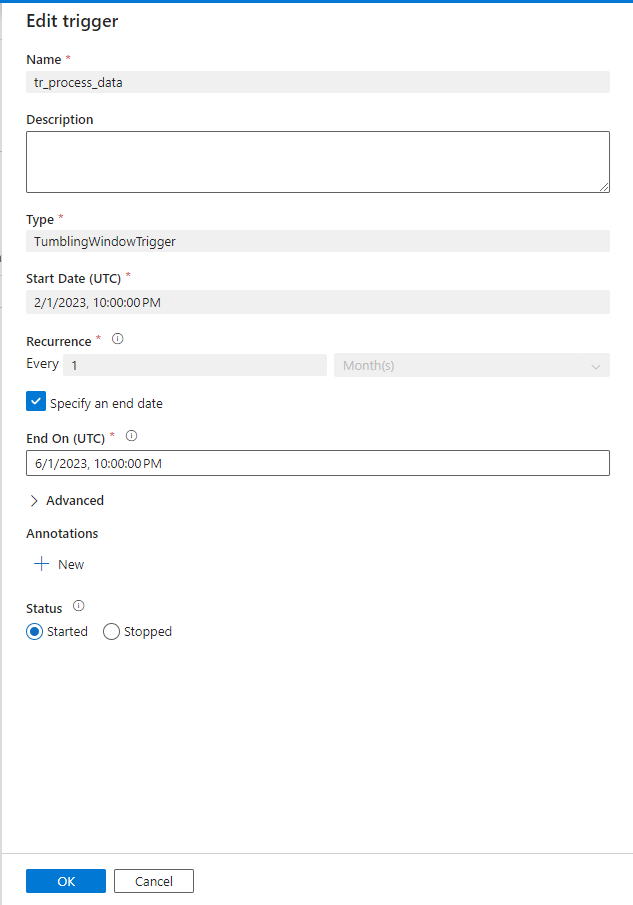

# Azure Data Factory (ADF) ARM Template Deployment Guide

## Overview

This guide provides step-by-step instructions for deploying an Azure Data Factory (ADF) using ARM (Azure Resource Manager) templates. Additionally, it will explain how the pipelines in this data facyory work.

## Part 1: Deploying the ADF ARM Templates

### Folder Structure

The repository includes the following files and directories:

- `factory/`
  - Contains the main ARM template and its parameters for the ADF instance.
  - Files:
    - `sample-adf_ARMTemplateForFactory.json`: The main ARM template defining the ADF instance.
    - `sample-adf_ARMTemplateParametersForFactory.json`: Parameters for deploying the ADF instance.

- `linkedTemplates/`
  - Contains linked ARM templates for additional resources.
  - Files:
    - `ArmTemplate_0.json`: Linked template for extra ADF resources.
    - `ArmTemplate_master.json`: Master template for pipeline configurations.
    - `ArmTemplateParameters_master.json`: Parameter file for the master template.

### Deployment Methods

1. **Method 1: Azure Portal**  
   You can deploy the ARM templates directly through the Azure Portal by uploading the provided JSON files.

2. **Method 2: Azure CLI**  
   Use the Azure CLI to deploy the ARM templates with the necessary parameters.

3. **Method 3: PowerShell**  
   Deploy the ARM templates using Azure PowerShell commands.

For full details on each method, refer to the [Microsoft Learning Guide](https://learn.microsoft.com/en-us/azure/data-factory/).

---

## Part 2: Explanation of ADF Pipelines

This section provides an in-depth explanation of the key pipelines implemented in your ADF instance. These pipelines follow a **Medallion Architecture** to process data through Bronze, Silver, and Gold layers.

### Pipeline Overview

- **`pl_aggregation_gold_layer`**
- **`pl_full_load_bronze_silver_tables`**
- **`pl_incremental_load_bronze_silver_tables`**
- **`pl_process_medallion_data`**

### Pipeline Details

#### 1. `pl_aggregation_gold_layer`

This pipeline is responsible for creating summarized and aggregated data in the **Gold Layer**, which is optimized for business reporting.

- **Input**: Data from the **Silver Layer**.
- **Transformation**: The pipeline applies aggregation functions like `SUM()`, `AVG()`, and `COUNT()`.
- **Output**: Curated and aggregated data is saved in the **Gold Layer** for consumption in reporting tools (e.g., Power BI).

#### 2. `pl_full_load_bronze_silver_tables`

This pipeline handles the **full load** of data from the **Bronze Layer** to the **Silver Layer**, which typically happens during initial data loads or complete data refreshes.

- **Input**: Raw data from the **Bronze Layer**.
- **Transformation**: Data is cleaned, transformed, and standardized to be ready for business logic.
- **Output**: Processed data is written to the **Silver Layer** for further refinement.

#### 3. `pl_incremental_load_bronze_silver_tables`

This pipeline processes **incremental loads** from the **Bronze Layer** to the **Silver Layer**, only loading new or updated data.

- **Input**: Data from the **Bronze Layer** that has been recently added or changed.
- **Transformation**: Filters records based on timestamps or other identifiers to capture only the latest changes.
- **Output**: Incrementally updates the data in the **Silver Layer**.

#### 4. `pl_process_medallion_data`

This is the **master pipeline** that orchestrates the entire Medallion data flow from **Bronze** to **Gold** layers.

- **Step 1**: Loads raw data into the **Bronze Layer**.
- **Step 2**: Transforms data from **Bronze** to **Silver Layer**.
- **Step 3**: Aggregates refined data in the **Gold Layer** for business reporting.

This pipeline ensures the end-to-end data flow across the medallion architecture.

### Trigger detail
The **`tr_process_data`** trigger is a **Tumbling Window Trigger** that schedules the pipeline to run at regular intervals.

- **Start Date**: Defines when the trigger begins. In this example, it starts on **February 1, 2023**.
- **Recurrence**: Specifies how often the pipeline runs (e.g., every 1 month).
- **End Date**: The trigger stops running after this date (e.g., **June 1, 2023**).

#### How to Modify the Trigger

You can adjust the **start date** and **end date** to control the period for data extraction. For example:
- Setting the **Start Date** to **February 1, 2022**, and the **End Date** to **February 1, 2023**, will extract all data from **2022**.

Users can also change the **recurrence** to daily, weekly, or monthly depending on their needs.

### Note
- Trigger is created as TumblingWindow because data is from the past and folder name past date
- You need to re-config Datasets and Linked Service after deploying the templates
